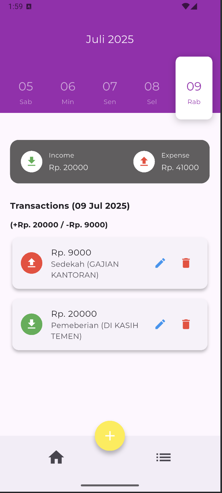
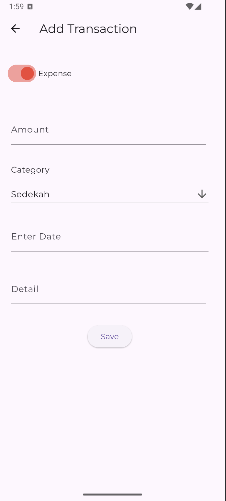
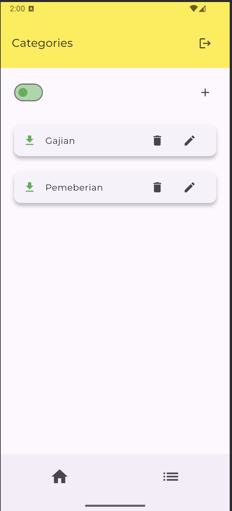

# 📱 MyFlutterApp - Aplikasi Mobile Pencatat Keuangan

> Dibuat menggunakan Flutter & Dart  
> Project Mata Kuliah **Pemrograman Mobile**  
> Oleh: Ryandra & Erlangga

---

## ✨ Ringkasan Singkat

Aplikasi mobile untuk mencatat pemasukan dan pengeluaran harian, dengan fitur utama seperti tambah transaksi, filter tanggal, dan ringkasan keuangan bulanan. Data disimpan **lokal** tanpa koneksi internet.

---

## 🧠 Latar Belakang

Manajemen keuangan pribadi menjadi tantangan, terutama bagi anak muda yang sering melakukan pembelian impulsif — yaitu membeli sesuatu secara tiba-tiba tanpa perencanaan. Aplikasi ini dikembangkan sebagai solusi praktis untuk melacak arus kas harian secara cepat dan sederhana.

---

## 🎯 Tujuan Aplikasi

- Mencatat transaksi (income/expense)
- Menyediakan ringkasan keuangan bulanan
- Menyimpan data secara lokal tanpa internet
- Memberikan UI yang simpel dan efisien

---

## 🛠️ Teknologi yang Digunakan

- Flutter & Dart
- Drift (Local Database)
- Flutter Material Widgets (tampilan modern dan responsif)

---

## 📱 Tampilan Aplikasi

| Home Page | Add Transaction | Add Category |
|-----------|-----------------|---------|
|  |  |  |

---

## 🧩 Fitur Utama

- [x] Tambah/Edit/Hapus Transaksi
- [x] Filter transaksi berdasarkan tanggal (kalender/date picker)
- [x] Ringkasan total pemasukan dan pengeluaran
- [x] UI adaptif, responsif, dan clean

---

## 🧪 Alur Penggunaan

1. Buka aplikasi
2. Tambahkan kategori baru (jika diperlukan)
3. Tambahkan transaksi keuangan
4. Lihat ringkasan dan filter berdasarkan tanggal
5. Done 💸

---

## 🤝 Pembagian Tugas

| Nama     | Tanggung Jawab                                                                 |
|----------|---------------------------------------------------------------------------------|
| Ryandra  | Homepage, UI Category & Transaction, Integrasi Drift, Final Debug & Integration |
| Erlangga  | CRUD Category, Insert & Show Transaction, Update & Delete Transaction           |

---

## 🧠 Pembelajaran & Tantangan

- Implementasi database lokal dengan Drift
- Modularisasi UI agar reusable & maintainable
- Debugging perbedaan perilaku UI antara emulator dan device asli

---

## 📌 Catatan Tambahan

- Data disimpan **lokal** (tidak memerlukan koneksi internet)
- Kompatibel dari Android SDK 21+
- Potensi pengembangan: menyimpan dan menyinkronkan data pengguna ke cloud menggunakan Firebase, agar data tetap aman dan bisa diakses di berbagai perangkat.

---

## 🔮 Rencana Pengembangan (Opsional)

- State management menggunakan Provider atau Riverpod
- Fitur dark mode
- Visualisasi data keuangan dengan chart
- Export data ke PDF/Excel
